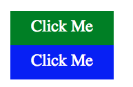

#Lesson Three; Custom Classes

HTML and CSS are great pairings on their own, but relying on the built in classes and tags is extremely limiting. On most webistes, you can find a diverse number of componenets, each having a number of variations as well. Part of what makes this framework useful is that it's tailored to something called modularization.

This style of thinking and writing code is an extention of UNIX idealogy -- which amounts to "write code that does one thing, and does that one thing well." This type of thinking is primarily associated with "object oriented programming," or "functional programming," which are admittedly different to HTML and CSS. So how do we apply this to HTML/CSS?

Modularizing code with these two languages looks like writing pieces of a puzzle which come together on the full site. If you can craft all of the code for your buttons, navbars, headers, and other reusable pieces then you can assemble your page with those prewritten parts. The work is all done beforehand, and instead of slaving away writing the same pieces over and over again, or using copy-paste a number of times for large sections you can devote minimal work to tedious tasks and more to the design side.

The first part to writing these separate components is using custom classes. Let's start by making a button class for our site. Take a look at the example below:

```
//HTML
<button>

	<p>Click Me</p>

</button>
```

This is some HTML and represents a button that uses the built in tags. To reiterate: this is NOT a custom class. ```<button>``` already exists in the language. For simple solutions, this is a handy. We can easily write some CSS to help format this as well. 

```
//CSS
button {
	background: green;
}
button.p {
	color: white;
	font-size: 1.5em;
}
```

But there are a few issues here which makes this sub-optimal to our purposes. As is, this is a screenshot of what the button above, rendered with teh following HTML and CSS examples would look like:


As you can see, the button class already comes with a bit of formatting on it's own. When clicked, it has the highlight border around it, which we may not want. In order to delete this, we have to write additional code to opt out. 

If we want to have additional variations on buttons, our code can get a little messier:

```
//HTML
<button id="type1">

	<p>Click Me</p>

</button>

<button id="type2">

	<p>Click Me</p>

</button>

```
Inside the tag we are using the ```id``` selector to specify which buttons the different rules (in this case colors) apply to. To specify this in CSS, we use the # key to make this distinction:

```
//CSS
button {
	color: white;
	font-size: 1.5em;
}

button:focus { //this gets rid of the focus highlight on the border
	outline: none;
}

button#type1 {
	background: green;
}

button#type2 {
	background: blue;
}

```
Using the original tags can create a lot of excess work for us to opt out of the original styling and add variations between the differnt types of buttons we want. Using the id selector is similar enough to using the class selector to differentiate between types that it's difficult to justify not using custom classes. At a bare minimum by using anything that has rules applied to it by default, our locus of control shrinks which leaves room for error and uncertainty when we build our site. 

This provides high incentive to create our own classes. We can implement solutions that in the long run will shrink the total amount of code we have to write, and we know exactly what rules will be applied to the class becuase we are writing everything from scratch. 

Custom classes use the ```div``` tag, followed by the class selector like so:

```
//HTML
<div class="button type1">

	<p>Click Me</p>

</div>

<div class="button type2">
	
	<p>Click Me</p>

</div>

```
Notice we have two class selectors inside the div tag. This is technically a larger amount of code, but the amount of control that we earn is worth is. Additionally, later in the course we can implement more parts of the framework to make the bulk of our writing work go away anyways. 

```
//CSS

.button {
	color: white;
	font-size: 1em;
	width: 150px;
	height: 50px;
	text-align: center;
	padding: 10px;
	cursor: pointer;

}

.button.type1 {
	background: green;
}

.button.type2 {
	background: blue;
}

```
Notice that there is a lot more code written in the ```.button``` class. The reason why, is because there were several rules prewritten for the built in button class. Using custom classes means that we have a bit more work to write, but we only have to write it once and we know exactly how our buttons will look and how they will behave. 

Let's look at the screenshots for these examples:



Our two different methods look relatively the same, and they both serve the same function. 

