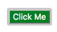

#Lesson Three; Custom Classes

HTML and CSS are great pairings on their own, but relying on the built in classes and tags is extremely limiting. On most webistes, you can find a diverse number of componenets, each having a number of variations as well. Part of what makes this framework useful is that it's tailored to something called modularization.

This style of thinking and writing code is an extention of UNIX idealogy -- which amounts to "write code that does one thing, and does that one thing well." This type of thinking is primarily associated with "object oriented programming," or "functional programming," which are admittedly different to HTML and CSS. So how do we apply this to HTML/CSS?

Modularizing code with these two languages looks like writing pieces of a puzzle which come together on the full site. If you can craft all of the code for your buttons, navbars, headers, and other reusable pieces then you can assemble your page with those prewritten parts. The work is all done beforehand, and instead of slaving away writing the same pieces over and over again, or using copy-paste a number of times for large sections you can devote minimal work to tedious tasks and more to the design side.

The first part to writing these separate components is using custom classes. Let's start by making a button class for our site. Take a look at the example below:

```
<button>

	<p>Click Me</p>

</button>
```

This is some HTML and represents a button that uses the built in tags. This is fine, and we can easily write some CSS to help format this as well. 

```
button {
	background: green;
}
button.p {
	color: white;
	font-size: 1.5em;
}
```

But there are a few issues here which makes this sub-optimal to our purposes. As is, this is a screenshot of what the button above, rendered with teh following HTML and CSS examples would look like:




As you can see, the button class already comes with a bit of formatting on it's own. When clicked, it has the highlight border around it, which we may not want. In order to delete this, we have to write additional code to opt out. 

If we want to have additional variations on buttons, our code can get a little messier:

```
//HTML
<button class="type1">

	<p>Click Me</p>

</button>

<button class="type2">

	<p>Click Me</p>

</button>

```
And our CSS file as well:

```
//CSS
button {
	color: white;
	font-size: 1.5em;
}

button:focus { //this gets rid of the focus highlight on the border
	outline: none;
}

button.type1 {
	background: green;
}

button.type2 {
	background: blue;
}

```
Eventually this can create a whole lot of excess work for us to first, opt out of the original styling; and second, to write out "button.xxx" for every variation.

```
<div class="button">
	

</div>

```

